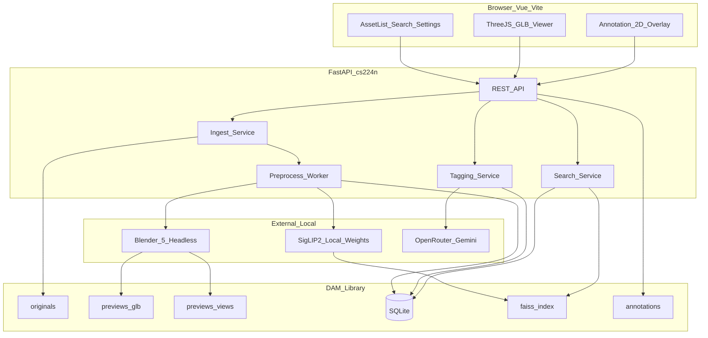
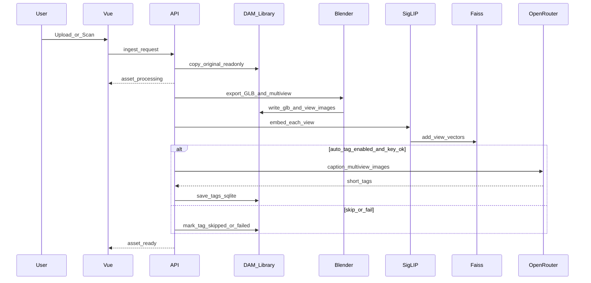
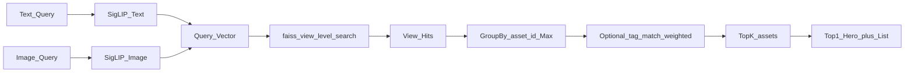

# DAM 3D 资产库产品需求文档（PRD）

| 字段 | 内容 |
|------|------|
| 产品名称 | DAM 3D Render（3D 数字资产管理系统 · 研究原型） |
| 文档版本 | v1.1 |
| 文档状态 | 已确认（2026-07-16 增补分格式渲染、依赖资产包与固定首帧规范） |
| 产品定位 | 内部技术验证 / 研究原型 |
| 开发环境 | conda 环境 `cs224n`（Python 3.11） |
| 代码仓库 | `E:\code\Projects\DAM_3D_Render` |
| 测试资产 | `E:\code\Data\3D\CC` |
| 托管库默认根目录 | `E:\code\Data\DAM_Library\` |

---

## 1. 背景与目标

### 1.1 背景

游戏与内容制作中，3D 资产格式多样、体积大、难以在浏览器中快速审阅与检索。本项目建设一套单机可用的 DAM（Digital Asset Management）原型，验证「任意格式入库保管 → 预处理 → 秒级可交互预览 → 图文相似检索 → 浏览器批注」的完整链路。

### 1.2 产品目标

| 目标 ID | 目标 | 成功判据 |
|---------|------|----------|
| G-1 | 安全保管原件 | 原件复制入托管库后格式与内容不被预处理改写 |
| G-2 | 秒级可交互预览 | 白名单格式资产，从打开预览到可旋转/缩放 ≤ 2 秒（本机 SSD、原型测试条件下） |
| G-3 | 图文相似检索 | 支持文字查询与上传图片查询，返回 Top-K 资产；Top-1 最大化展示 |
| G-4 | 打标增强检索 | 支持手动打标与多模态自动打标；文字检索时标签参与加权 |
| G-5 | 审阅批注 | 预览时可画色框、文字、箭头；可持久化并可导出 |

### 1.3 非目标（v1 不做）

见 [第 4.2 节 Out of Scope / Roadmap](#42-out-of-scope--roadmap)。

---

## 2. 用户与场景

### 2.1 用户

| 角色 | 说明 |
|------|------|
| 单机使用者（本人） | 本机启动服务，浏览器访问 `localhost`；无登录、无多租户 |

### 2.2 核心场景

| 场景 ID | 场景 | 简述 |
|---------|------|------|
| S-1 | 批量导入已有盘 | 指定本地目录（如 `E:\code\Data\3D\CC`）扫描，复制入托管库并跑预处理 |
| S-2 | 零散上传 | 浏览器拖拽/选择文件上传入库 |
| S-3 | 浏览与秒级预览 | 资产列表中打开白名单 3D 资产，2 秒内可交互 |
| S-4 | 文字检索 | 输入描述，得到最相似资产（大图）及其余 Top-K−1 |
| S-5 | 以图搜图 | 上传参考图，同样 Top-K 展示 |
| S-6 | 打标 | 入库时手动打标；有 API Key 时自动打标；可失败重试 |
| S-7 | 批注审阅 | 在预览画布上标注并保存；导出 PNG/JSON |

---

## 3. 范围

### 3.1 In Scope（v1）

- 单机单用户部署（本机 FastAPI + 浏览器前端）
- 入库：浏览器上传 + 本地目录扫描；原件**复制**进托管库；原件只读保管
- 格式：任意文件可入库；3D 秒级预览仅保证白名单（OBJ / FBX / BLEND / GLTF / GLB）
- 预处理：Blender 无头转 GLB、多视图渲图、GLB/缩略图压缩或 LOD、SigLIP2 Embedding 写入 faiss、自动/手动打标
- 预览：Three.js + GLB；可交互首屏 ≤ 2s；自动检测 GPU 并优先 GPU 渲染
- 检索：统一多模态 Embedding；文字 + 以图；默认 Top-K=10；Top-1 大图 + 下方列表；标签加权
- 批注：屏幕/画布 2D 叠加（色框、文字、箭头）；持久化；导出 PNG 与 JSON
- 设置：OpenRouter API Key、Blender 路径、库根目录、Top-K、多视图数、打标开关与 prompt、检索 α/β 等

### 3.2 Out of Scope / Roadmap

| 项 | 归属 |
|----|------|
| 接近最终观感（材质/贴图基本到位）仍 ≤ 2 秒 | Roadmap |
| 批注 3D 世界坐标锚定（随模型旋转粘附） | Roadmap |
| Qwen3-VL-Embedding + Qwen3-VL-Reranker 升级检索 | Roadmap |
| 多用户、权限、审计、公有云 SaaS | Out of Scope |
| 承诺非白名单格式也可 3D 秒级预览 | Out of Scope（可入库，预览降级） |
| 必须打标成功才算入库完成 | Out of Scope（v1 失败不阻断） |

---

## 4. 术语

| 术语 | 定义 |
|------|------|
| 原件（Original） | 用户上传或扫描复制进托管库的原始文件；预处理不得改写其格式与内容 |
| 衍生品（Derivative） | 由预处理生成的 GLB、多视图图、缩略图、向量、批注数据等 |
| 托管库（Managed Library） | DAM 管理的磁盘根目录，默认 `E:\code\Data\DAM_Library\` |
| 预览白名单 | v1 保证转 GLB 并秒级可交互预览的格式：`.obj` `.fbx` `.blend` `.gltf` `.glb` |
| 多视图（Multi-view） | 对资产从多个相机方位渲染的预览图；默认 4 张，可配置 |
| 视图向量 | 单张多视图图经 SigLIP2 得到的一条 Embedding，单独写入 faiss |
| 资产级 Top-K | 检索先在视图级召回，再按 `asset_id` 聚合后得到的前 K 个资产 |
| 可交互首屏 | 浏览器中模型已显示，且用户可开始旋转/缩放（允许先低模/渐进增强） |

---

## 5. 功能需求

### 5.1 入库（Ingest）

| ID | 需求 | 优先级 |
|----|------|--------|
| FR-ING-01 | 支持浏览器拖拽或选择文件上传；服务端将文件复制到托管库 `originals/` | P0 |
| FR-ING-02 | 支持在设置中指定本地根目录，一键扫描/增量导入；命中文件复制到 `originals/`（不移动源盘文件） | P0 |
| FR-ING-03 | 入库不限制文件格式与大小策略上的「业务拒收」（磁盘不足等系统错误除外）；非白名单同样可入库 | P0 |
| FR-ING-04 | 原件入库后，任何预处理步骤不得覆盖、转写或删除原件文件 | P0 |
| FR-ING-05 | 入库后创建异步预处理任务，资产状态至少包含：`copied` / `processing` / `ready` / `ready_with_warnings` / `dependency_missing` / `preview_unsupported` / `failed` | P0 |
| FR-ING-06 | 上传与目录扫描共用同一套预处理管线 | P0 |
| FR-ING-07 | 增量扫描：已导入且源文件未变更（路径+大小+mtime 或内容哈希）的文件可跳过 | P1 |
| FR-ING-08 | 入库支持多文件、文件夹或 ZIP 资产包；复制到托管库时保持主文件与依赖文件的相对目录结构 | P0 |
| FR-ING-09 | `.mtl`、`.bin`、纹理图片等依赖文件归属于主资产，不得作为独立资产显示在资产库 | P0 |
| FR-ING-10 | 依赖关系以主文件内部声明为准；同名文件仅作为无声明时的辅助推断规则 | P0 |

### 5.2 预处理（Preprocess）

| ID | 需求 | 优先级 |
|----|------|--------|
| FR-PRE-01 | 使用格式适配器执行预处理：OBJ / FBX / GLTF 在 v1 默认通过 Blender 转为 GLB；GLB 原文件直接复制为预览文件，不进行 Blender 二次导出 | P0 |
| FR-PRE-02 | 按格式独立生成多视图图至 `previews/views/`；默认 4 视图，设置可改 1–8；一种格式的修复不得改变其他格式的处理结果 | P0 |
| FR-PRE-03 | 为秒级预览对 GLB/贴图做合理压缩或 LOD（允许渐进增强）；压缩只作用于衍生品 | P0 |
| FR-PRE-04 | 对每张多视图图用 SigLIP2 计算 Embedding，**每视图一条**写入 faiss，并在 SQLite 记录 `asset_id`、视角、向量 ID 映射 | P0 |
| FR-PRE-05 | 支持用户在入库/详情中手动编辑标签（短词列表） | P0 |
| FR-PRE-06 | 配置了 OpenRouter API Key 且「自动打标」开启时，将多视图图提交给 `google/gemini-3-pro-preview` 自动打标；**不得**把原始 3D 文件直接作为模型输入 | P0 |
| FR-PRE-07 | 默认自动打标 prompt：`使用短词描述这个游戏资产`；prompt 可在设置中修改 | P0 |
| FR-PRE-08 | 无 API Key、关闭自动打标、或 API 失败时：入库与预览/Embedding 管线不阻断；资产标记打标失败/跳过，支持手动重试 | P0 |
| FR-PRE-09 | 非白名单格式：跳过 GLB/多视图/3D 预览相关步骤；仍保管原件；UI 显示「暂不支持 3D 预览」 | P0 |

**实现备注（写入实现阶段，非产品歧义）：**

- 默认 Blender：`D:\Program Files (x86)\Blender Foundation\Blender 5.0\blender.exe`
- 3D 自动打标业界路径：多视图渲染图（可多图或拼图）→ VLM；主流多模态 API 不直接消费 mesh/FBX/BLEND

#### 5.2.1 分格式转换与渲染策略

| 格式 | v1 转换方式 | 网格处理 | 固定视角 | 材质与光照 |
|------|-------------|----------|----------|------------|
| BLEND | 使用 Blender `open_mainfile` 打开完整场景后导出 GLB | 可过滤背景平面、相机、灯光等工作场景辅助对象；主体筛选只允许用于 BLEND | 薄片型资产可按包围盒最大面自适应取景 | 固定图使用稳定灰模；交互预览支持灰模与原材质 |
| OBJ | Blender 导入后导出 GLB | 必须保留全部有效网格和独立小部件，不得按面数或尺寸删除 | 固定标准四视图 | 中性灰模；有 MTL/纹理时写入 GLB |
| FBX | Blender 导入后导出 GLB | 必须保留全部有效网格和独立部件 | 固定标准四视图 | 中性灰模；尽量保留材质、骨骼和动画 |
| GLTF | 解析依赖并由 Blender 打包为单文件 GLB | 必须保留全部有效网格和独立部件 | 固定标准四视图 | 保留可解析的材质、纹理、动画和灯光 |
| GLB | 原文件直接复制并由 Three.js 原生加载；Blender 只生成固定图 | 不修改原始场景结构 | 独立生成固定标准视图 | 默认原材质；保留 PBR、贴图、顶点颜色、透明度、动画及 `KHR_lights_punctual` |

格式适配器必须遵守以下规则：

- 修复特定格式前，必须判断问题属于某个格式、某类资产还是单一文件。
- BLEND 的辅助对象过滤和自适应相机不得应用于 OBJ、FBX、GLTF 或 GLB。
- OBJ、FBX、GLTF 等交换格式可能把完整资产拆成大量大小不同的独立网格，禁止依据面数、尺寸比例或部件大小删除对象。
- GLB 已是浏览器原生交付格式，预览副本与托管原件应进行 SHA-256 校验且结果一致。
- 后续可增加 OBJ 的 trimesh/Assimp、FBX 的 FBX2glTF/Assimp、GLTF 的 glTF-Transform/glTFpack 快速通道；快速通道失败或产物校验不通过时必须回退 Blender。

#### 5.2.2 OBJ / MTL 依赖处理

**OBJ 同时包含 MTL 或纹理时：**

1. 解析 OBJ 的 `mtllib` 指令，以声明路径为准查找 MTL。
2. 解析 MTL 的 `map_Kd`、`map_Ks`、`map_d`、`bump` / `map_Bump`、`norm` 等纹理引用。
3. 将 OBJ、MTL 和纹理作为同一资产包复制并保持相对路径。
4. 从托管资产包中的 OBJ 导入，再导出包含材质和可用贴图的 GLB。
5. 若 OBJ 未声明 `mtllib`，但同目录仅有一个同名 MTL，可自动关联并记录“推断关联”日志。

**只存在 OBJ 时：**

- 未声明 MTL：按纯几何资产导入，保留全部网格，使用中性灰色 PBR 材质，状态为 `ready` 并提示“未提供材质”。
- 声明了 MTL 但文件缺失：继续生成几何预览，状态为 `ready_with_warnings` 并列出缺失路径。
- MTL 存在但纹理缺失：保留可解析的颜色等参数，缺失通道使用默认值，状态为 `ready_with_warnings`。
- 缺少 MTL 或纹理不得导致网格删除、拒绝入库或生成不完整主体。

#### 5.2.3 GLTF / BIN 依赖处理

**GLTF 同时包含 BIN 或外部纹理时：**

1. 解析 GLTF JSON 中的 `buffers[].uri` 与 `images[].uri`。
2. 将 GLTF、实际引用的 BIN 和纹理作为同一资产包复制并保持相对路径。
3. 使用 Blender 导入完整资产包并打包为单文件 GLB。
4. 校验输出中的网格、材质、纹理、动画和灯光扩展。
5. `filename.gltf` 与 `filename.bin` 同名不是强制条件，依赖关系以 URI 声明为准。

**只存在 GLTF 时：**

- 如果 buffer 与 image 均为 Data URI，或不需要外部资源，则视为自包含 GLTF，正常转换并标记 `ready`。
- 如果声明了外部 BIN 但文件缺失，则原件仍可入库，但不得生成空白 GLB；状态为 `dependency_missing` 并列出缺失 BIN。
- 如果网格 buffer 完整但外部纹理缺失，则继续生成几何预览，使用默认材质通道，状态为 `ready_with_warnings` 并列出缺失纹理。

**依赖补充与安全：**

- 用户可补充 MTL、BIN、纹理等依赖并触发重新处理；补充依赖不得覆盖主原件。
- 禁止通过 `../`、绝对路径或 ZIP 路径穿越访问资产包之外的文件。
- HTTP/HTTPS 外部依赖默认不自动下载。

### 5.3 预览（Preview）

| ID | 需求 | 优先级 |
|----|------|--------|
| FR-PVW-01 | 浏览器内使用 Three.js 加载预览 GLB，支持旋转、缩放、平移 | P0 |
| FR-PVW-02 | **硬指标**：白名单资产在 `ready` 后，从进入预览页到可交互首屏 ≤ 2 秒（本机 SSD、原型测试条件） | P0 |
| FR-PVW-03 | 允许先展示简化/压缩 GLB，细节渐进增强；「接近最终观感 ≤ 2s」不作为 v1 验收 | P0 |
| FR-PVW-04 | 自动检测设备是否具备可用 GPU（WebGL/WebGPU 能力），有则走 GPU 渲染路径以提升帧率与加载表现 | P0 |
| FR-PVW-05 | 无 GPU 或检测失败时回退 CPU/软件可用路径，并在 UI 提示当前渲染模式 | P1 |
| FR-PVW-06 | 资产未就绪时展示处理中状态；失败时展示错误与可重试入口 | P0 |
| FR-PVW-07 | 资产库卡片与预览页默认首帧必须复用同一张固定预览图，确保构图、视角、材质、光照和资产完整性完全一致 | P0 |
| FR-PVW-08 | 用户拖动、滚轮缩放或触摸后，固定图切换为实时交互 3D | P0 |
| FR-PVW-09 | 查看器提供“灰模 / 原材质”切换；灰模使用中性双面材质与兜底三点布光 | P0 |
| FR-PVW-10 | GLB 默认使用原材质；若包含内嵌灯光则优先使用文件灯光，无内嵌灯光时启用查看器兜底灯光 | P0 |

### 5.4 检索（Search）

| ID | 需求 | 优先级 |
|----|------|--------|
| FR-SRCH-01 | 支持文字查询：将查询文本经 SigLIP2 文本塔编码为 query 向量 | P0 |
| FR-SRCH-02 | 支持以图搜图：用户上传图片经 SigLIP2 图像塔编码为 query 向量 | P0 |
| FR-SRCH-03 | faiss 中按**视图级**向量检索；召回后按 `asset_id` 去重聚合 | P0 |
| FR-SRCH-04 | 资产相似度 = 该资产各视图得分的 **Max**；结果卡片展示得分最高的那张视图缩略图 | P0 |
| FR-SRCH-05 | 默认返回 Top-K=10（设置可改）；UI：**Top-1 最大化显示**，其余 Top-K−1 按相似度在下方列表排序 | P0 |
| FR-SRCH-06 | 文字查询时，在视觉相似度基础上叠加标签/自动描述匹配加权：`final = α · visual_sim + β · tag_match`；默认偏视觉（建议默认 α=0.7，β=0.3，可配置） | P0 |
| FR-SRCH-07 | 以图搜图默认可不叠加标签项（β=0），或沿用同一公式但 tag_match=0 | P1 |
| FR-SRCH-08 | Embedding 模型：`google/siglip2-so400m-patch16-512`；权重目录 `E:\Weights\VLM\siglip2-so400m-patch16-512`；**现阶段不强制启动时校验权重是否下载完毕** | P0 |

### 5.5 批注（Annotation）

| ID | 需求 | 优先级 |
|----|------|--------|
| FR-ANN-01 | 在 3D 预览画布上提供 2D 叠加层，工具至少包括：彩色矩形框、文字、箭头 | P0 |
| FR-ANN-02 | 批注锚定为屏幕/画布 2D（及可选「创建时相机视角快照」元数据）；不要求随模型 3D 变换粘附 | P0 |
| FR-ANN-03 | 批注按资产持久化；支持加载、编辑、删除 | P0 |
| FR-ANN-04 | 支持导出：① 带批注的预览图（PNG）；② 批注数据 JSON | P0 |

### 5.6 设置与配置（Settings）

| ID | 需求 | 优先级 |
|----|------|--------|
| FR-SET-01 | OpenRouter API Key 输入与安全保存（本地配置/环境变量）；不写死在源码；不进入 git | P0 |
| FR-SET-02 | Blender 可执行文件路径可配置；默认见技术约束 | P0 |
| FR-SET-03 | 托管库根目录可配置；默认 `E:\code\Data\DAM_Library\` | P0 |
| FR-SET-04 | Top-K、多视图数量、自动打标开关、打标 prompt、α/β 可配置 | P0 |
| FR-SET-05 | 自动打标模型 ID 默认为 `google/gemini-3-pro-preview`，允许配置覆盖 | P1 |

---

## 6. 非功能需求

| ID | 类别 | 需求 |
|----|------|------|
| NFR-01 | 性能 | 白名单资产可交互首屏 ≤ 2s（见 FR-PVW-02） |
| NFR-02 | 部署 | 单机单用户；本机启动后端，浏览器访问；无登录 |
| NFR-03 | 数据完整性 | 原件不可变；衍生品与原件分目录 |
| NFR-04 | 安全 | API Key 仅本地配置注入；日志脱敏，不打印完整 Key |
| NFR-05 | 可配置性 | 库路径、Blender、模型路径、检索与打标参数均可配置 |
| NFR-06 | 可维护性 | faiss 相关实现须含**教学级中文注释**（面向未使用过 faiss 的开发者），说明索引创建、增删、检索与 ID 映射如何工作 |
| NFR-07 | 兼容性 | 开发/运行默认 conda `cs224n` |
| NFR-08 | 降级 | 无 Key / 打标失败 / 非白名单 / 无 GPU 时系统仍可用并有明确状态提示 |
| NFR-09 | 格式隔离 | 格式适配器相互独立；修改一种格式后必须验证该格式并回归其他已支持格式，不得把专用规则扩散为全局规则 |
| NFR-10 | 依赖安全 | 所有 sidecar 依赖必须限制在资产包目录内；禁止路径穿越、绝对路径越界和默认网络下载 |
| NFR-11 | 测试清洁 | 自动化验收产生的探针资产必须在测试后删除数据库记录、托管原件、衍生品、向量和批注，不得残留在正式资产库 |

---

## 7. 系统架构与数据流

### 7.1 逻辑架构



### 7.2 入库与预处理数据流



### 7.3 检索数据流



---

## 8. 数据模型与目录约定

### 8.1 托管库目录（默认根：`E:\code\Data\DAM_Library\`）

```text
E:\code\Data\DAM_Library\
  originals\           # 原件副本（只读保管，按 asset_id 分目录或扁平+元数据）
  previews\
    glb\               # 预览 GLB（可含 LOD 变体）
    views\             # 多视图 PNG/JPG
  embeddings\          # 可选：向量旁路缓存/调试导出
  annotations\         # 批注 JSON（若不以纯 DB 存储文件）
  faiss\               # faiss 索引文件与 id 映射
  dam.sqlite3          # 元数据库
  config.local.json    # 可选本地配置（含密钥引用，勿提交 git）
```

### 8.2 逻辑实体（SQLite）

**Asset（资产）**

| 字段 | 说明 |
|------|------|
| id | 主键 |
| name | 展示名 |
| original_path | 托管库内原件路径 |
| source_path | 扫描来源路径（若有） |
| format / ext | 扩展名 |
| status | 处理状态 |
| preview_supported | 是否白名单预览成功 |
| glb_path | 预览 GLB 路径 |
| created_at / updated_at | 时间戳 |
| tag_status | `none` / `manual` / `auto` / `failed` / `skipped` |

**Tag（标签）**

| 字段 | 说明 |
|------|------|
| asset_id | 外键 |
| tag | 短词 |
| source | `user` / `auto` |

**ViewEmbedding（视图向量映射）**

| 字段 | 说明 |
|------|------|
| asset_id | 外键 |
| view_id | 视角标识（如 front/right/back/left） |
| image_path | 多视图文件路径 |
| faiss_id | faiss 中的向量 ID |
| dim | 向量维度 |

**Annotation（批注）**

| 字段 | 说明 |
|------|------|
| id / asset_id | 标识 |
| type | `rect` / `text` / `arrow` |
| geometry | 2D 坐标与样式（颜色、线宽、文字内容） |
| camera_snapshot | 可选：创建时相机参数 |
| created_at / updated_at | 时间戳 |

**Job（预处理任务）**

| 字段 | 说明 |
|------|------|
| asset_id / stage | 阶段：copy / glb / views / embed / tag |
| status / error | 状态与错误信息 |

### 8.3 faiss 行为规格（产品级）

| 规则 | 说明 |
|------|------|
| 粒度 | 一资产多视图 → 多条向量 |
| 度量 | 向量归一化后使用内积（等价余弦相似度）或等价配置；实现须在注释中说明 |
| 检索 | 视图级 Top-N 召回（N ≥ K，建议可配置，默认例如 50） |
| 聚合 | 按 `asset_id` 分组，取 Max 得分作为资产分 |
| 展示 | 使用贡献 Max 分的那张视图作为结果缩略图 |
| 教学要求 | 实现代码须逐步注释：Index 选型（原型建议 `IndexFlatIP`）、`add`、`search`、ID 映射表如何与 SQLite 对齐、删除/重建策略 |

---

## 9. 技术约束

| 层级 | 选定方案 |
|------|----------|
| 后端 | FastAPI |
| 元数据 | SQLite |
| 向量索引 | faiss（教学级中文注释强制要求） |
| 前端 | Vue + Vite |
| 3D 预览 | Three.js + GLB；自动检测 GPU，优先 GPU 渲染 |
| 转换 / 多视图 | 格式适配器：OBJ / FBX / GLTF 默认 Blender 5.0 无头转换；GLB 原文件直接预览、Blender 仅生成固定图；默认 Blender 路径 `D:\Program Files (x86)\Blender Foundation\Blender 5.0\blender.exe` |
| Embedding | `google/siglip2-so400m-patch16-512` @ `E:\Weights\VLM\siglip2-so400m-patch16-512`（现阶段不强制校验下完） |
| 自动打标 | OpenRouter → `google/gemini-3-pro-preview`；输入多视图图 |
| Python 环境 | conda `cs224n` |
| 测试数据 | `E:\code\Data\3D\CC`（包含 BLEND、FBX、OBJ、GLB 及后续外部依赖测试包） |

**预览白名单（v1）：** `.obj` `.fbx` `.blend` `.gltf` `.glb`

---

## 10. 界面要点（产品规格）

### 10.1 检索结果页

1. **Top-1**：最大化主区域展示（最佳匹配视角缩略图 + 关键信息 + 相似度）
2. **其余结果**：主区域下方按相似度降序列表（第 2…K 名）
3. 点击任一结果进入预览（含批注）

### 10.2 预览页

- 左侧或主区：Three.js 画布
- 默认首帧：复用资产库卡片的同一张固定图；拖动、滚轮或触摸后切换为交互 3D
- 工具条：灰模 / 原材质 / 色框 / 文字 / 箭头 / 保存 / 导出 PNG / 导出 JSON
- 侧栏：标签编辑、预处理状态、原件下载（可选）

### 10.3 设置页

- API Key、Blender 路径、库根目录、Top-K、多视图数、打标开关与 prompt、α/β、渲染模式只读状态（GPU/CPU）

---

## 11. 验收标准

验收环境：本机；conda `cs224n`；测试源目录 `E:\code\Data\3D\CC`；托管库 `E:\code\Data\DAM_Library\`。

### 11.1 入库与原件保护

- [ ] **AC-01** 通过「目录扫描」导入指定的跨格式测试文件，托管库 `originals/` 出现对应主文件及依赖包副本，依赖文件不作为独立资产显示
- [ ] **AC-02** 导入后对比源文件与副本（哈希或大小+抽查），预处理前后原件一致，扩展名未被改写
- [ ] **AC-03** 源目录 `E:\code\Data\3D\CC` 内文件仍存在且未被移动/修改
- [ ] **AC-04** 浏览器上传单个 `.obj` 或 `.fbx` 可完成复制并进入预处理队列
- [ ] **AC-05** 上传一个非白名单扩展名（如 `.zip` 或任意二进制）可入库，状态为不可 3D 预览，不导致服务崩溃

### 11.2 预处理与白名单预览

- [ ] **AC-06** `.obj`、`.fbx`、`.blend` 均可生成 GLB 与默认 4 张多视图（或当前配置张数）
- [ ] **AC-07** 对已 `ready` 的白名单资产，从点击进入预览到可旋转/缩放 ≤ 2 秒（本机 SSD；记录三次取中位）
- [ ] **AC-08** 预览页显示当前是否 GPU 渲染；有独显/可用 GPU 时应走 GPU 路径
- [ ] **AC-09** 多视图数量改为 2 后重新预处理，视图文件数量与配置一致

### 11.3 打标

- [ ] **AC-10** 未配置 API Key 时资产仍可 `ready`（Embedding/预览不依赖打标成功）
- [ ] **AC-11** 配置 Key 并开启自动打标后，对测试资产产生自动短词标签；失败时有状态且可重试
- [ ] **AC-12** 用户可手动增删标签并持久化刷新后仍在
- [ ] **AC-13** 自动打标请求内容为预览图，而非直接上传 `.blend/.fbx/.obj` 原件

### 11.4 检索

- [ ] **AC-14** 文字检索返回不超过 K 条资产；默认 K=10；UI Top-1 大图 + 下方列表
- [ ] **AC-15** 以图搜图（可用多视图中一张作 query）返回按 Max 聚合的资产列表，并展示最佳视角图
- [ ] **AC-16** 修改 Top-K 设置后下次检索生效
- [ ] **AC-17** 为某资产打上独特手动标签后，用该词检索时该资产排序相对纯视觉有合理提升（标签加权生效）

### 11.5 批注

- [ ] **AC-18** 可在预览中绘制色框、文字、箭头并保存；刷新后仍可加载
- [ ] **AC-19** 可导出带批注 PNG 与批注 JSON
- [ ] **AC-20** 旋转 3D 模型时，批注保持 2D 叠加行为（不要求 3D 粘附）

### 11.6 配置与安全

- [ ] **AC-21** 设置中可保存 OpenRouter API Key；源码与仓库中无明文 Key
- [ ] **AC-22** 可修改 Blender 路径与库根目录并在后续任务中生效

### 11.7 格式隔离、依赖与固定画面

- [ ] **AC-23** `butterfly.blend` 固定图完整显示蝴蝶，不包含工作场景黑色背景板，且不会因相机方向显示为侧面竖线
- [ ] **AC-24** `锦鲤.blend` 固定图和交互预览均可清晰辨认
- [ ] **AC-25** `All_Stylized_ship.obj` 保留全部独立网格部件；修复 OBJ 后，FBX 版本结果保持不变
- [ ] **AC-26** `12 Watermelon.glb` 显示原始 PBR 材质颜色，托管原件与预览 GLB 的 SHA-256 完全一致
- [ ] **AC-27** 含内嵌贴图的 GLB 在前端正确显示贴图；含 `KHR_lights_punctual` 的 GLB 优先使用内嵌灯光
- [ ] **AC-28** 所有格式的资产库固定图与预览页默认首帧使用同一图片；用户开始操作后可切换至实时交互 3D
- [ ] **AC-29** OBJ + MTL + 纹理可生成带材质 GLB；只有 OBJ 时完整显示全部网格并使用中性材质
- [ ] **AC-30** OBJ 声明的 MTL 缺失时显示警告但不阻断几何预览；MTL 贴图缺失时列出缺失清单
- [ ] **AC-31** GLTF + BIN + 纹理可生成完整 GLB；自包含 GLTF 可单文件成功转换
- [ ] **AC-32** GLTF 缺失必要 BIN 时不得生成空白 GLB；仅缺纹理时仍可显示几何并产生警告
- [ ] **AC-33** `.mtl`、`.bin` 和纹理不作为独立资产；补充依赖后可重新处理
- [ ] **AC-34** 自动化验收结束后，`probe.bin` 等临时资产及其全部衍生数据已被清理

---

## 12. 风险与依赖

| 风险 / 依赖 | 影响 | 缓解 |
|-------------|------|------|
| Blender 5.0 路径或插件/导入器差异 | GLB/多视图失败 | 路径可配置；任务失败可重试；记录 Blender 日志 |
| SigLIP2 权重尚未下完 | Embedding/检索不可用 | 启动不强制校验；UI 提示权重未就绪；预览与入库仍可测 |
| OpenRouter 费用/限流/模型更名 | 自动打标失败 | 失败不阻断；模型 ID 可配置 |
| 大场景 BLEND 转 GLB 过慢 | 影响「入库后多久可预览」 | 异步任务+状态；SLA 计量点为 ready 后的打开预览，不含首次转换时间 |
| 仅集成显卡或 WebGL 受限 | 预览卡顿 | 强制压缩/LOD；回退路径与提示 |
| faiss 与 SQLite ID 不同步 | 检索错乱 | 重建索引工具；注释清晰的映射约定 |
| OBJ/GLTF 外部依赖缺失 | 材质丢失或无法生成网格 | 入库前解析依赖清单；区分必要 buffer 与可降级纹理；支持补充依赖后重试 |
| 格式专用修复影响其他格式 | 已通过资产出现回归 | 使用独立格式适配器；每次修改执行跨格式回归验收 |

---

## 13. 里程碑建议（无固定日期）

| 阶段 | 产出 |
|------|------|
| M0 | PRD 确认（本文档） |
| M1 | 工程骨架：FastAPI + Vue + 托管库目录 + SQLite |
| M2 | 入库复制 + Blender GLB/多视图管线 + 预览页打通 |
| M3 | 预览 SLA 达标（压缩/LOD/GPU 检测） |
| M4 | SigLIP2 + faiss 视图级检索 + Top-K UI |
| M5 | 手动/自动打标 + 标签加权 |
| M6 | 2D 批注持久化与导出 |
| M7+ | Roadmap：观感 SLA、3D 批注锚定、Qwen3-VL-Embedding/Reranker |

---

## 14. 决策记录（锁定）

| 维度 | 结论 |
|------|------|
| 定位 | 内部技术验证 / 研究原型 |
| 部署 | 单机单用户，无登录 |
| 预览 SLA | 可交互首屏 ≤ 2s；观感级 ≤2s → Roadmap |
| 格式策略 | 入库全收；预览白名单 OBJ/FBX/BLEND/GLTF/GLB |
| 入库入口 | 上传 + 目录扫描 |
| 原件策略 | 复制进托管库；预处理不改原件 |
| 托管库 | `E:\code\Data\DAM_Library\` |
| 转换 | 格式适配器：OBJ / FBX / GLTF 默认 Blender；GLB 原文件直接预览；支持未来快速通道失败后回退 Blender |
| 多视图 | 默认可配置，默认 4 |
| 格式隔离 | BLEND 专用的辅助对象过滤/自适应相机不得影响 OBJ、FBX、GLTF、GLB |
| 外部依赖 | OBJ/MTL/纹理和 GLTF/BIN/纹理按资产包解析，依赖文件不作为独立资产 |
| 固定首帧 | 资产库卡片与预览页默认首帧复用同一图片，交互后切换实时 3D |
| 打标 | 手动 + OpenRouter Gemini；默认 prompt；失败不阻断 |
| 检索 | SigLIP2；faiss 每视图一条；Max 聚合 + 最佳视角；Top-K=10；Top-1 大图 |
| 标签与检索 | `final = α·visual + β·tag`，默认偏视觉 |
| 批注 | v1：2D 叠加 + 持久化 + 导出；3D 锚定 → Roadmap |
| 栈 | FastAPI + SQLite + faiss + Vue/Vite + Three.js/GLB（GPU 优先） |
| Roadmap 模型 | Qwen3-VL-Embedding、Qwen3-VL-Reranker |

---

## 15. 附录：测试集清单（当前）

路径：`E:\code\Data\3D\CC`

| 文件 | 扩展名 | v1 预期 |
|------|--------|---------|
| All_Stylized_ship.fbx | .fbx | 入库 + GLB 预览 + 多视图 + 检索 |
| All_Stylized_ship.obj | .obj | 同上 |
| butterfly.blend | .blend | 同上 |
| 锦鲤.blend | .blend | 入库 + GLB 预览 + 多视图 + 检索 |
| 12 Watermelon.glb | .glb | 原文件直接预览 + 原始 PBR 材质 + 彩色多视图 + SHA-256 一致性 |
| OBJ + MTL + 纹理测试包 | 资产包 | 依赖解析、材质打包、缺失依赖降级 |
| GLTF + BIN + 纹理测试包 | 资产包 | URI 依赖解析、GLB 打包、缺失 BIN/纹理分级处理 |

---

*本文档为 v1 实现与验收的唯一产品规格来源。实现细节若与本文冲突，以更新后的 PRD 版本为准。*
